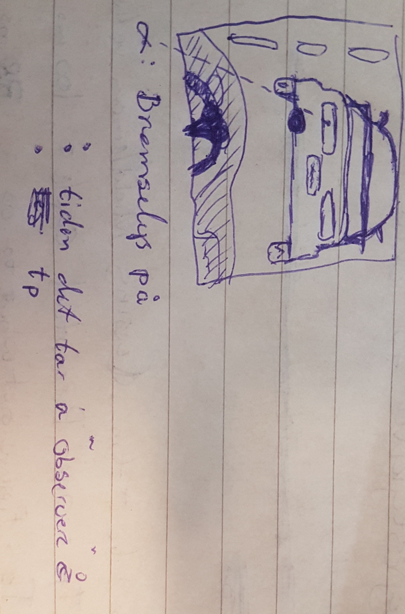
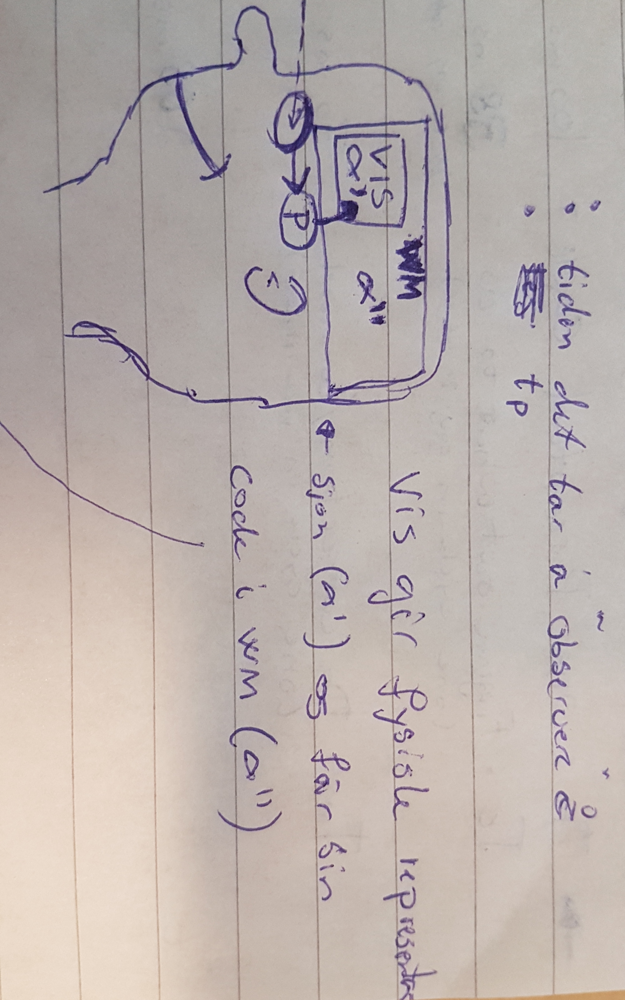
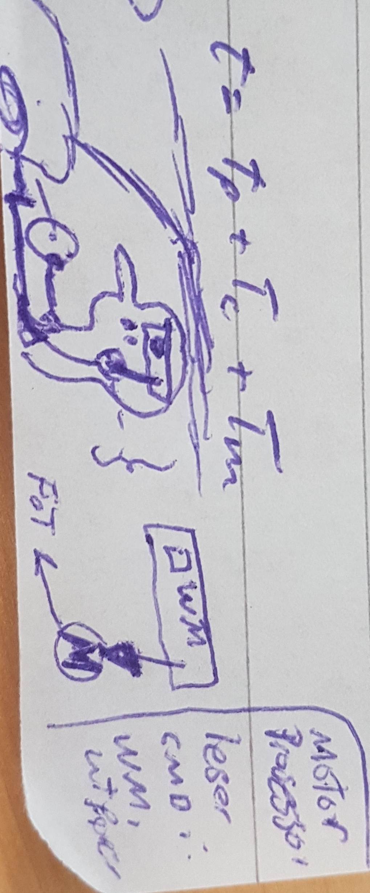
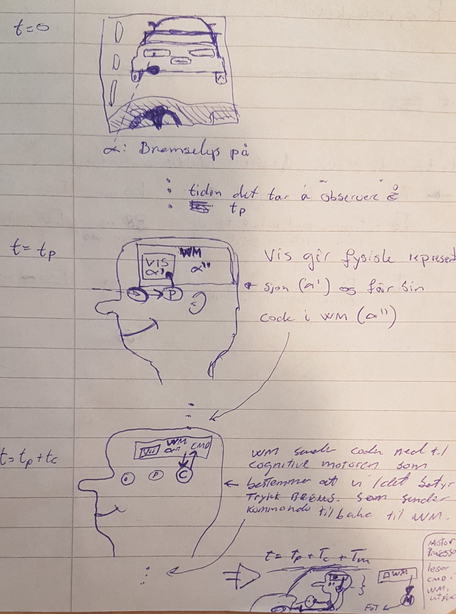
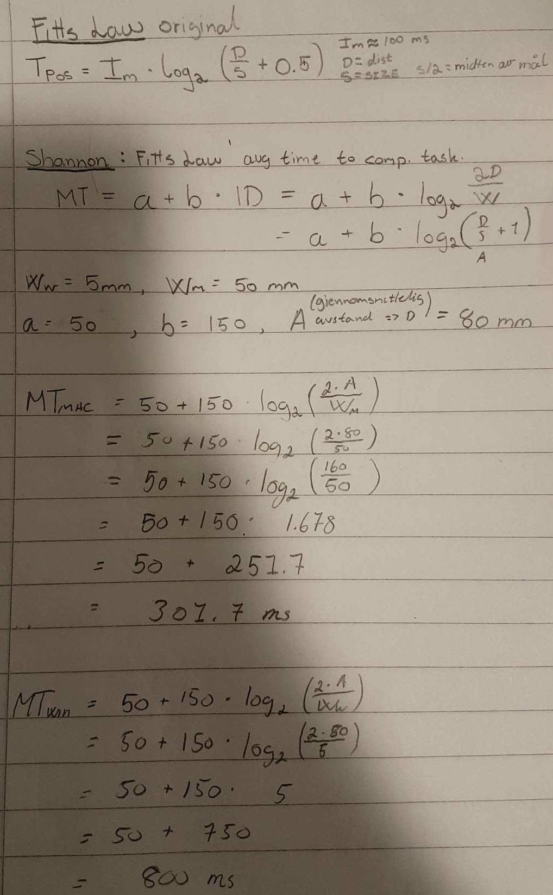

# TDT4237 - Kogark
*Øving 1 - Sigve Skaugvoll*

## Oppagve 1.
### A)
Ved t = 0, så ser personen som kjører, på bilen forrans seg sitt bremselys skifte fra av til på. Sjoføren er altså forberedet på at det skal skje og sitter og venter. Her kan vi definere 𝛂, som tiden det hendelsen at bremselyset blir tent.

Det neste som skjer og koster bare 1 sykel hos den persepsjonelle motoren. Sjoføren sin persepsjons motor  bruker da tiden  tp  på å registrere hendelsen 𝛂 og laste den inn i Visual image store, markert 𝛂' og laste den inn i Working Memory, markert 𝛂''.
Alt dette koster bare en sykel tid for persepsjon motoren. VIS gir fysisk representasjon av hendelsen 𝛂 kalt 𝛂' og får 𝛂 enkodet, markert som  𝛂'' i WM.
***Etter dette er tiden t = tp.***  

Det neste som skjer etter tp, er at den kognitive motoren bruker en sykel på å, lese fra WM matche hendelsen 𝛂 sin kode 𝛂'' med en kommando for bevegelse/korreksjons motoren, og laster denne kommandoen opp inn i WM.  
Denne matchingen koster en sykel av tc og ***etter det er tiden t = tp + tc***.

Etter at den kognitive motoren har funnet motor kommandoen, og lagt den i WM, så bruker motoren en sykel på å lese fra WM, også utføre selve kommandoen. Når dette er gjort ***er tiden brukt siden 𝛂, t = tp + tc + tm***.

I dette tilfellet kan vi bruke gjennomsnitts tall for verdiene tp, tc og tm.
tp: 1 sykel  : 100 ms [50 ~ 200]

tc: 1 sykel  : 70ms [25 ~ 170]

tm: 1 sykel  : 70 ms [30 ~ 100]

t = tp + tc + tm = (100 + 70 + 70)ms = 240 ms.

### B)
Her må brukeren først observere flagget, laste det inn i VIS og WM med enkoding. Så må den kognitive prosessoren mate kodingen for 𝛂'', mot både WM, men den er ikke der så da må den kognitive prosessoren laste finne match i LTM (slå opp skandinaviske flagg)  og laste dette inn i WM. Så må den kognitive prosessoren matche om flagget er skandinavisk. Så må den legge en kommando for motor prosessoren om det er match eller ikke.

I skandinavia er det 3 land. --> 3 chunks.

* tp 1 sykel : observere og laste inn i vis og wm

* tc 1 sykel : fetch : hente semantisk navn fra LTM : Long term memory is access on every 70 msec cognitive memory (p41).

* tc 1 sykel : match : match mot kunnskap om skandinaviske flagg hentet fra LTM :

* tc 1 sykel : generere : genrere motorkomando i WM.

Så tiden totalt vil bli   t = tp + 3 \* tc
                            = 100ms           3 \* 70ms          
                            = 310ms  

### C)
***Index of difficulty***
Index of difficulty kommer fra Fitt's law.
Fitt's law er et uttrykk;
* Tpos = Im\*log2 (D/S + 0.5)

som beregner tiden det tar å flytte hånden fra en plass til en annen plass.
D = distanse til mål/ flytte.
S er størrelsen på plassen vi skal flytte til.

Index of difficulty er log uttrykket i Fitt's law, og er en metrikk for å kvantifisere / beregne vanskeligheten ved en måleoppgave.
Hvor vi måler tiden det tar å flytte hånden. Og vanskeligheten vil synke jo nærmere vi kommer. Men siden flytting av hånden består av mange mikro-bevegelser/flyttninger av hånden. Trenger vi en evaluerings funksjon (Index of difficulty) som kan si noe om hvor bra vi flytter oss slik at vi kan korrigere hånd-flytting mot mål.  

En annen måte å tenke på ID er : hvor vanskelig motor-kommandoen som skal utføres er.

***Bruke Fitt's law.***

### D)
Hvis mer en 10 bilder i sekunder blir fanget opp av prosessoren, så vil det bli smeltet sammen, og vises som kontinuitet i tid. Dette er gitt at tp = 100ms. Så når det perseptuelle systemet oppfatter alt som skjer innenfor en perseptuell motor sykel, som en enhet av tid, må 1 / tp  må være > 1. så 1 / 0.1s = 10 frames per second.
