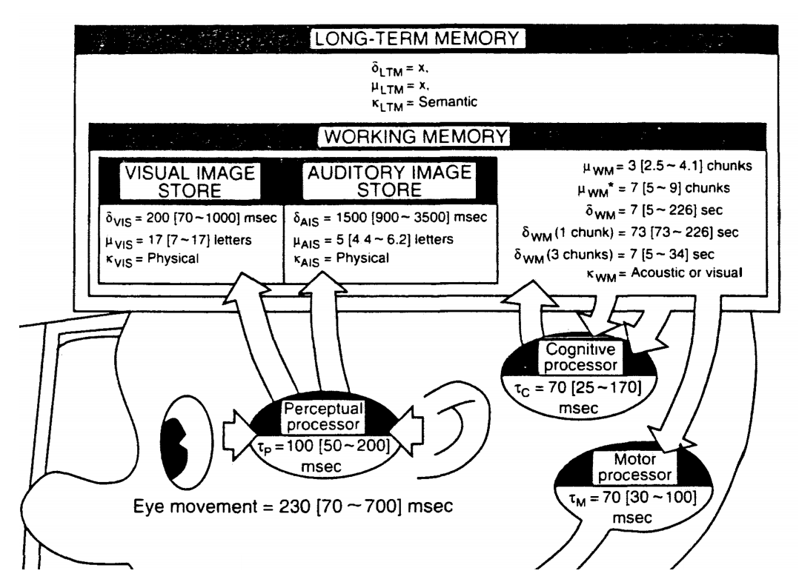
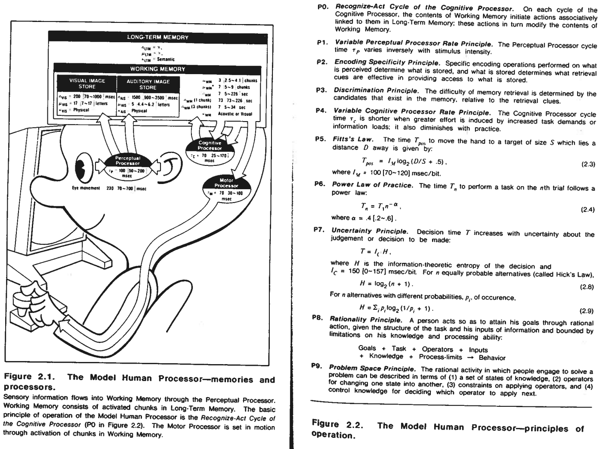

# The Human Infomration-Processor

## 2.1 The Model Human Processor
The human mind is an inforamtion-processing system.

***The Model Human Processor***  can be described by
* a set of memories and processors together with
* a set of principles, hereafter called the "principles of operation."

***Three interaction subsystems - creates MHP***
* the perceptual system
* the motor system
* the cognitive system
Each with its own memories and processors.

### The Perceptual system
The perceptual system consists of sensors and associated buffer memories, the most important buffer memories being a VISUAL IMAGE STORE (VIS) and an AUDITORY IMAGE STORE (AIS) to hold the output of sensory system while it is being symbolically coded.

### The Cognitive System
The cognitive system recieves symbolically coded inforamtion from the sensory image storeis in its WORKING MEMORY and uses previously stored inforamtion in LONG-TERM MEMORY to make decisions about how to respond.

### The Motor System
The motor system carries out the response.

***Different responses to different tasks*** i.e. pressing a key in response to a light, the human must behave as a serial processor (sekvential). For other tasks such as typing, reading and simultaneous translation, integrated, parallel operation of the three subsystems is possible, in the manner of three pipelined processors:
* inforamtion flows continuosly from input to output with a characteristically short time lag showing that all three processors are working simultaneously.

#### Memories and Processors parameteres.

##### Memory
* µ : the storage capacity in items,
* 𝛿 : the decay time of an time
* κ : the main code type (physical, acoustic, visual, semantic)

##### Processor
* т : the cycle time

Since computer memories are usually also characterized by their access time, there is *no separate parameter for access time in this mode since it is included in the processor cycle time*.

### The Perceptual System Cont.
The eye is in continual movement in a sequence of saccades, each taking about 30 msec to jump to the new point of regard and dwelling there 60 ~ 700 msec for a total duration of

* Eye-movement = 230 [70-700] msec.

 * In this statetment the number 230 msec represents a typical value and
 * the numbers in brackets indicate that values may range from 70 msec to 700 msec.

    * Depending on conditions of measurement, task variables, or subject variables.- We do sometimes have to move our head to reduce the angular distance. These four parts-central vision, periphiral vision, eye movements, and head movements operate as an integradet system. 

#### Perceptual memories
Very short after the onset of a visual stimulus, a representation of the stimulus appears in the Visual Image Store of the Model Human Processor. (for an auditory stimulus, it goes to the auditory image store).
***These sensory memories hold information coded physically*** - that is, as an unidentified, non-symbolic analogue to the external stimulus. This code is affected by physical properties of the stimulus, such as intensity.

* κVIS = physical
* κAIS = physical

***i.e*** the VISUAL IMAGE STORE representation of the number 2 contains features of curvature and length (or equivalent spatial frequency atterns) as opposed to the recognized digit.

The perceptual memories ar eintimately related to the cognitive Working Memory schematically.

The Visual Image Store and the Auditory Image Store over time, has some decay. As an index of decay time, we use the half-life defined as the time after which the probability of retrieval is leess than 50%. While exponential decay is not necessarily implied by the use of half-life.

* The visual image store has a half-life of about
 * 𝛿VIS = 200 [90 ~ 1000] msec
 
    * Since the CAPASITY **µ**VIS is hard to to fix preciesly, for rough working purposes may be taken to be about 17 [7 ~ 17] 

***Note:*** the Auditory Image Store decays more slowly. This because auditory informatiom must be interpreted over time.

* 𝛿VIS = 1500 [900 ~ 3500] msec 

* Since CAPASITY **µ**AIS is hard to to fix preciesly, for rough working purposes may be taken to be about 5 [4.4 ~ 6.2] 

#### Perceptual Processor
To identify the cycle time tp of the Perceptual Processor is identifiable with the so-called **unit impulse response** and its duration is on the order of 

* tp = 100 [50 ~ 200] msec.

If a stimulus impiges upon the retina at time t - 0, at the end of time t = tp the image is available in the Visual Image Store and the human claims to see it. (This is an approximation, since different information iin the image becomes avilable at different times). 

Perceptual events occuring within a single cycle are comibined into a single percept (video / continous time line).

* I * t = k, t < tp
 * I = intensity (i.e. light brightness)
 * t = time

***The processor time tp is not completly constant, but varies somewhat according to conditions.***

* in particulat tp is shorter for more intense stimuli. which is stated in this **principle** 

    > Variable Perceptual Processor Rate Principle.
     * The perceptual Processor cycle time tp varies inversely with stimulus intensity.

* The effect of this principle is such that tp cantake on values within the 50 ~ 200 msec range we have given, and under some "extreme" condition, values even outside these ranges.

   
### The Motor System cont.
Thought is finally translated into action by activaiting patterns of voluntary muscles. This are arranged in pairs of opposing "agonists" and "antagonists:

* The two most importants sets are
 * arm hand finger system
 * head eye system.

Movement is not contiuous, but consists of a series of discrete micromovements, each requiring about

* tM = 70 [30 ~ 100] msec  # the cycle time of the Motor Processor.

***Feedback loop from action to perception is sufficently long (200 ~ 500msec)*** that rapid behavioral acts such as typing and speaking myst be executed in bursts of preprogrammed motor instrcutions.

The loop of feedback is:

* Perception process requires tP  msec to observe and send information to the cognitive system
* the cognitiv system can then advise (the decision process requires tC msec) and create a motor instruction,
* motor system reads instruction and executes the correction (takes tM msec)
* Total time is :  tP  +  tC  +  tM 

### The Cognitive System cont.
> simplified overview
 *  The cognitive system merely serves to connect inpus from the perceptual system to the right outpts of the motor system. - most tasks performed by a human are complex and involve learning, retrieval of facts or the solution of problems.

#### Congitive Memories
There are two important memories in the cognitive system

* WORKING MEMORY : to hold the information under current consideration
* LONG TERM MEMORY : to store knowledge for future use.

##### Working Memory
* Holds the intermediate products of thinking and thre representation produced by the perceptual system.
* where all mental operations obtain their operands and leacte their outputs.
* constitutes the general registers of the Cognitive Processor.
* consists of a subset of the elements in Long-Term Memory
* Can have many different encodings, but sybolic acoustic codes are especially common

> For purposes of the Model Human Processor we consider the predominant code types to be
* k = acoustic or visual

***Important to distinguish the sybolic, nonphysical acoustic or visual codes of Working Memory, which are unaffected by physical paramterers of the stimulus (such as intensity) FROM THE nonsymbolic, physical codes of the sensory image stores, which are affected by physical parameters of the stimulus.***.

##### Chunks
Elements of memory are called chunks.

* can be organized into larger units.
* Memory chungs (things we remember/ observe) --> can be related to other chunks.

Think of chunks as nested abstract expressions: ***CHUNK 1 = ( CHUNK 2, CHUNK 3, CHUNK 4), where CHUNK 4 = ( CHUNK 5, CHUNK 6 )***

What consitutes a chunk is as much a function of the user as of the task.

* depends on the contents of the users's Long-Term Memory

When coding something for memory, the coding has to be done both ways. i.e. converting a string of bits to a string of hexa.

* 0100001000010011011001101000
* 0100 0010 0001 0011 0110 0110 100
* 4 2 1 3 6 6 8  

The encoding has to be done both binary to hexa and hexa to binary.
i.e, the chunk ROBIN for example sounds like the chunk ROBERT. It is a subset of the chunk Bird, it has chunk WINGS, it can chunk FLY.

When a chunk in Long Term Memory is activated, the activation spreads to related chunks and to chunks related to thowse. ***As the activation spreads to new chunks, the previously activated chunks become less accessible, because there is a limited amount of activation resource. The new chunks are said to interfere with the old ones.***
- This intereferece is that the chunks appears to fade from Working Memoru with time.

* As a working value we take the half-life of x sec with working memory decay rate, and some other data, gives
  * 𝛿WM = 7 [5 ~ 226] sec.

Since the decay rate is particularly sensitive to the number of chunks in the recalled item, it is useful to record the decay rate of representative item sizes:
 * 𝛿M (1 chunk) = 73 [73 ~ 226] sec.
 * 𝛿WM (3 chunk) = 7 [5 ~ 34] sec 

When beeing asked to recall information a few seconds after hearing it, people use both Workin Memory and Long-Term Memory to do so.

***There is a __pure capacity of Working Memory__***

##### Long-Term Memory
Long-Term Memory holds the user's mass of available knowledge.

* Not possible to erase from Long-Term Memory
  * 𝛿LTM = infinity (positive)

***Retriveing from LTM***, The success of retrieval of chunk depends on whether associations, to it can be found. There are two reasons to why retrieving from LTM might fail
* effective retrieval associations cannot be found,
* similar associations to several chunks interfere with the retrieval fo the target chunk.

The predominant code type for LTM is - sematntic, and encoded into symbolic form : a pettern of light and dark might be coded as the letter A.

The more association a chunk has, the greater its probability of being retrieved.

* probability the item will be stored in LTM and linked so it can be retrieved increases with residence time in Working Memory, within a limit.
  * 𝛿WM sec / chunk

***LTM is accessed on every 70 msec cognitive processing cycle***

### Cognitive Processor
add img of cognitive processing rates. 

__CONTINUE ON PAGE 41__

#### Simple Reaction Time (page 66)
> example 9.
 * A user sits before a computer display terminal. Whenever any symbol apears, he is to press teh space bar. What is the time between signal and response?

This example is the same as the first task in the first assignment. Except for a computer display, there is a cars break light. and the space bar is the drivers break-pedal.

In this example, the "user" is in some state of attention to the breakelighs/ display. When the breaklight gets lit, we denote it 𝛂. it is processed by the Perceptual Processor, giving rise to a physically coded reprsentation of the sybmol, we denote it as 𝛂' in the Visual Image Store, and very shortly thereafter to a visually coded symbol, we write it 𝛂'' in Wokring Memory.

This process requires one Perceptual processor cycle, 𝛕P. 

The occurence of the stimulus is connected with a response, requiring one Cognitive Processor cycle, 𝛕C.

The Motor system then carries out the actual physical movement to push the break-pedal, requiring one Motor Processor cycle, 𝛕M. 

All this gives us a total time required = 𝛕P + 𝛕C + 𝛕M
* Here we can use Middleman values or Fastman and Slowman values.i

[comment]: # ( : add a pictures from the piece of paper given out, from this section )
