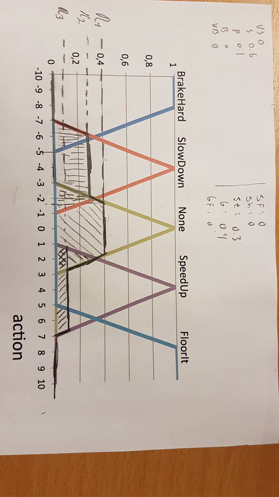

# Exercise 3
## Fuzzy logic and set
Sigve Skaugvoll, MIT, 2017

### A) Deciding action based on linguini variable, variable and fuzzy set
The value for distance = 3.7 and intersects `Small` at `0.6` and `Perfect` at `0.1`.

The value for delta = 1.2 and intersects `Stable` at `0.3` and `Growing` at `0.4`.

Using the action set:

- AND = min
- OR = max
- NOT x = 1-x

- values          0.6                0.4     ==> `min(0.6, 0.4) = 0.4`

> IF distance is Small AND delta is Growing THEN action is None

- values          0.6                 0.3   ==>  `min(0.6, 0.3) = 0.3`     

> IF distance is Small AND delta is Stable THEN action is SlowDown

values          (0.1)                   (0.4)   ==> `min(0.1,0.4) = 0.1`

> IF distance is Perfect AND delta is Growing THEN action is SpeedUp

- values           0                        (1-0.4)                    (1-0)   ==> `min(0, max(0.6, 1)) = 0`

> IF distance is VeryBig AND (delta is NOT Growing OR delta is NOT GrowingFast) THEN action is FloorIt

- values             0      ==>  0

> IF distance is VerySmall THEN action is BrakeHard

<!-- As we can se from plotting in the values, the `action` taken is / should be `None`, since it has the highest score, of `0.4`. -->

If we now clip the fuzzy sets based on these rule evaluations we get:

Now for the Defuzzification:

TOP = (BH* actionValueBH) + (SD * actionValueSD) + (N* actionValueN) + (SU* actionValueSU) + (F* actionValueF)

Bottom = (Number of of x values for BH * actionValueBH) + (Number of of x values for SD * actionValueSD) + (Number of of x values for N * actionValueN) + (Number of of x values for SU * actionValueAV) + (Number of of x values for F * actionValueF)

COG = T / B
= 0 + (-8.4) + 0 + 2.8 + 0 / 0 + 2.1 + 2.4 + 0.7 + 0
~ - 1.08

Now we know that the corresponding action is to just do Nothing (None).

### B) Mamdani-reasoner

`Mamdani` is a way to do `Fuzzy logic reasoning`

Mamdani Fuzzy Inference : simple `two-input one-output` problem, that includes rules.
The inference process is performed in four steps:
1. Fuzzification of the input variables.
2. Rule evaluation (inference).
3. Aggregation of the rule outputs (composition).
4. Defuzzification.
