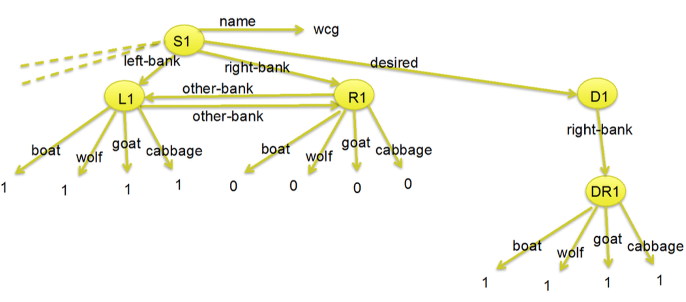

# Kogarg Exercise 5
## Sigve Skaugvoll

__Good book: https://books.google.com/books?id=80FXUtF5kRoC&pg=PA307&lpg=PA307&dq=soar+%22i-support%22&source=bl&ots=j3fji_17hZ&sig=sY76HYef90V4LoK8CBF2DfGInCA&hl=no&sa=X&ved=0ahUKEwjPu4X324_XAhWj14MKHU-rCy4Q6AEIUjAF#v=onepage&q&f=false__

## Task 1: The Soar processing cycle
**Input phase**
See stuff in the real world, and store in working memory

**Operation Selection**
Productions fire (and retract) to interpret new data (state elaboration), propose operators for the current situation (operator proposal), and compare proposed operators (operator comparison). All of the actions of these productions are I-supported. All matched productios fire in parallel (and all retractions occure in parallel), and matching and firing continues until there are no more additional complete matches or retractions of productions (quiescence).

__Decision__ A new operator is selected, or an impass is detected and a new state is created.

**Operation Application**
The new state created goes through the operation selcetion elaboration, then it goes to the application state. **application**, Productions fire to apply the operator (operator application). The actions of these productions will be O-supported. Because of changes from operator application productions, other productions with I-supported actions may also match or retract. Just as during proposal, productions fire and retract in parallel until quiescence.

**Output** Output commands are sent to the external environment.

The cuycles continue until the halt ction is issued from the Soar program (as the action of a production) or until Soar is interrupted by the user.

The difference between Operation selection and operation application elaboations is that in operation application, Rules that test the selected operator and modify the state are operator application rules. All other rules fire when they match.

## Task 2
### a)
The notion of I- and O-support in Soar is an importatn and fundamental concept. It distinguish between different types of support.

I-support means instantiation and its; Once an operator is proposed, its  preference persists until working memory no longer supports the operator preference.
- WM-elements created are removed whenever any WM-elemtns tested in rule condition are removed.
- Rule that doesn't test the urrent operator and make changes to the state

Operator actions that changes working memory, and are persistent over subsequent working memory changes are said to have `operator` or `O-support`
- All elements created by an operator-application rule persist until removed by an action of a rule or become disconnected rom the state

### b)
Impass means do the same rule evaluation approach as before, but now the goal is to choose between two operators for the original state,. and is the learning process. It means that there is no rule that is choosen and thus an branch off happens and a new rule is created from the state that did not have an action, with a new action that was created in the impasse. Thus the agent learns.

An event happens, and we doent know what to do. We have to choose one operator, but we cannot decide on one. Thus we need to create a new rule that indicates what rule / operator that we need to choose if such an event occures again.
Summed up; remember what happened, and what we did.

## Task 3: Representation

#### A) 
- _State identifier_ : `S1`
- _Attributter_ : `boat`
- _Value_ : `0` is the value for the state R1 (which is a substate from S1), and the attribute boat.

S1 is superstate to L1, R1 and D1. D1 us superstate to DR1.
S1's superstate is NIL.
L1, R1 and D1 are substates of S1, since its their superstate. 

#### B)
- _DR1_ is of type `state`, and has 4 possible attributes. 

## 4: Code knowledge 
> For each of the three code snippets, decide what type of rule it is.

Every rule in Soar starts with `sp`- soar production rule.
This is followed by the body of the rule, demarcated by `braces` around the body of the rule.
In the body, the name of the rule comes first.(the name means nothing to Soar, but can be usfull for programmers)
The name is followed by a list of conditions, whith each condition in `parentheses`.
Conditions are followed by `-->`; then there is the list of actions.
Conditions are a conjunctive set of tests.
Actions are a conjuctive set of actions.
Symbols are surrounded by `angle brackets`,
Variables look like this `<s>`

Conditions can test for the absence of working-memory selements.

The first condition of a rule must ALWAYS match a state

We want the right bank to have one of everything. 

First I need to know how many types of rule there are and what they are.
- propose
- detect
- initialize
- apply
- select

**Rule 1**
The first condition is to check that there is in deed selected an state `s`. and that the name is `wcg`. We also choose one of the following operators right- or left-bank. 

This rule has two conditions and the second is,
based on the bank choosen in the previously condition, we choose one of wolf, goat or cabbage as type and checks if the type is bigger than 0, we also check that we have the boat available (is one).

The conditions are to check that were at a bank (one of the sides of the river), and that we have one (amount) of the type, and the boat is on the same bank side as us.

Actions of this rule is, 
state `s` is binded to a operator choose `o` and makes sure that the operator is appliable (+) and we can choose randomly between the operators because thay are indifferent (`=` means equally good)  

Then we check if the operator choosen has the name move-boat, banks is bank and cargo is cargo. where we apply to the state - thus making this an applying rule.
The last action is setting the cargos type operator to one. Doing so is to "state" taht at this bank side, we have one of the cargo-type.

Thus. this is an _Apply rule_ because we modify the working memory with the update of state. saying that we have one of the cargo at this bank side.

**Rule 2**
is a quiescence rule - when no more rules match or retract. This rule writes (concatnate params, and prints them).Thus making an action based on wave of rules fiering.

The conditions for this rule are;
- check that a state is chosen, the name is wcg and an operator `o` is chosen.
- the operator `o` has the name move-boat, the thing is at the same bank-side as ous,  and there is not proposed/chosen a cargo.

If so the actions are;
- write out some stuff.
- modify the working memory by binding to the state s, that the operator were doing `o` is the last that is done.
- also modify the working memory to represent that we need to chose and transfer a cargo, since we have not chosen one. Setting the cargo to empty. 

Thus this is a _modifying rule_. We evalutate the state and propose that we need to chose a cargo since it's empty.

**Rule 3**
Is a detecting desired state rule. If the conditions is to `move-boat`, and we have cargo, the action is to write / print out: What type of cargo and number of the cargo. The name also indicates that this is a to detect state if we have inverse of failure, which is success.

The conditions are;
- check that we have state `s`, an appliable operator (+), we have detected that we have failed, something has eaten one of the other cargo, we have executed a rule, we remember the last operator. so that if we failed, we know what NOT to do in the state `s`
-  The operator now choosen is to move-boat and there is a cargo to transfer.
- The cargo has a number
- the last operator 

If the state has name, operator which is appliable, failure and a last operatore. And the operator is move-boat with cargo And the cargo is a number, And the last operator vas old cargo, and ocargo was ocargo and ocargo was of the same number as this cargo. 

Then write some stuff and bind the operator `o` to the state and mark the operator as BEST > and this operator should be selected if is not rejected or worse than another operator. 

Thus making this an _Propose rule / decision rule_. Indicating that this is possibly the best opertor to exectue to rech the goal state.

 
